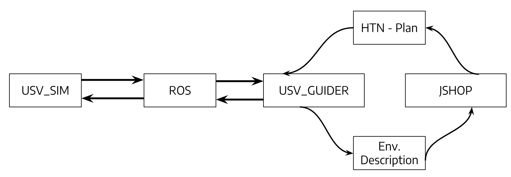
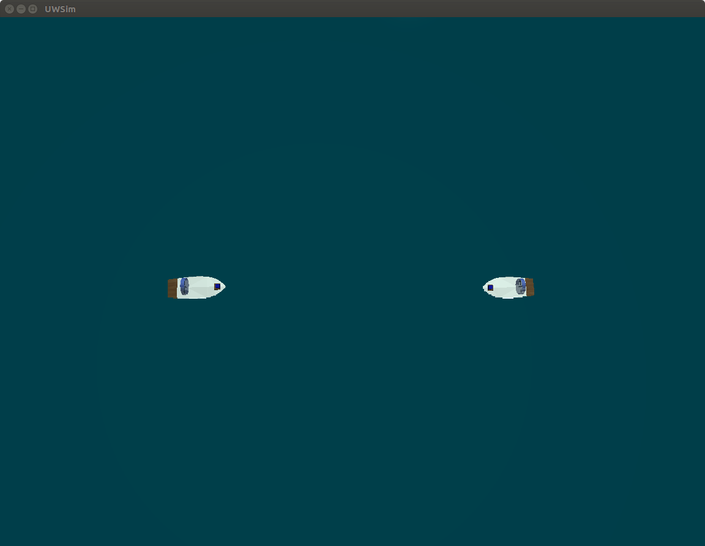
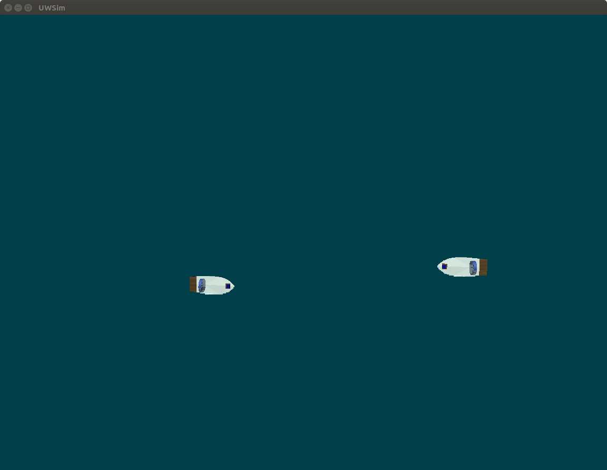
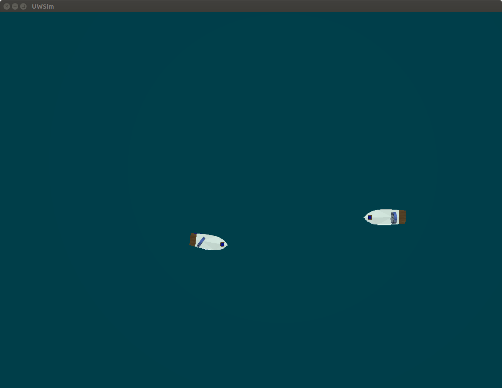
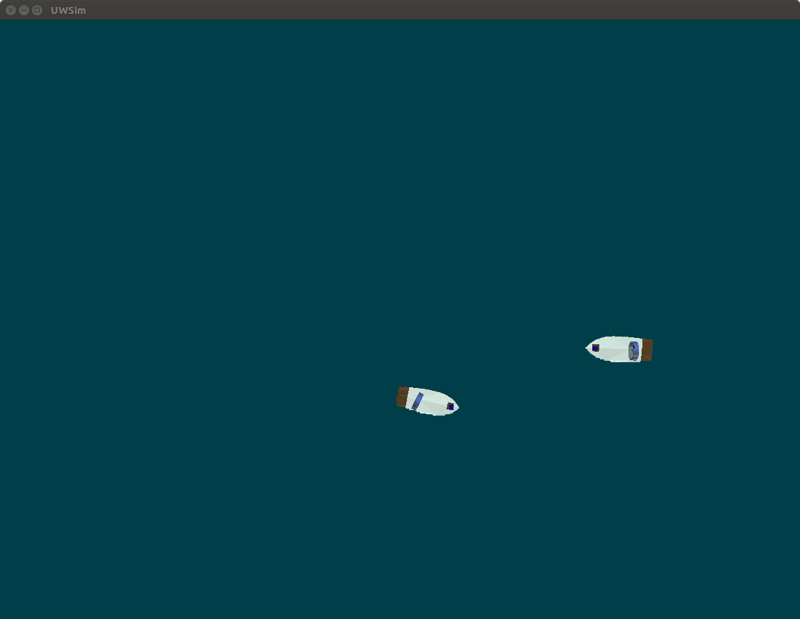
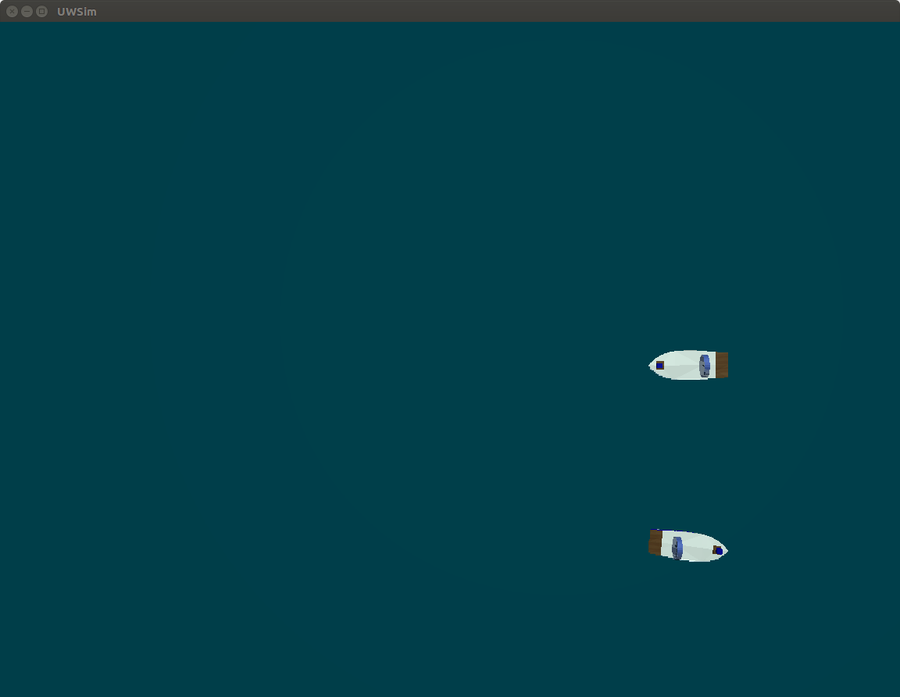
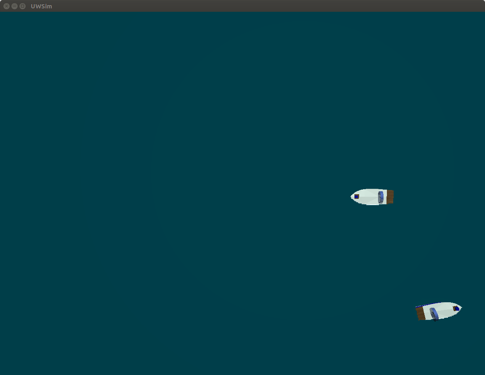
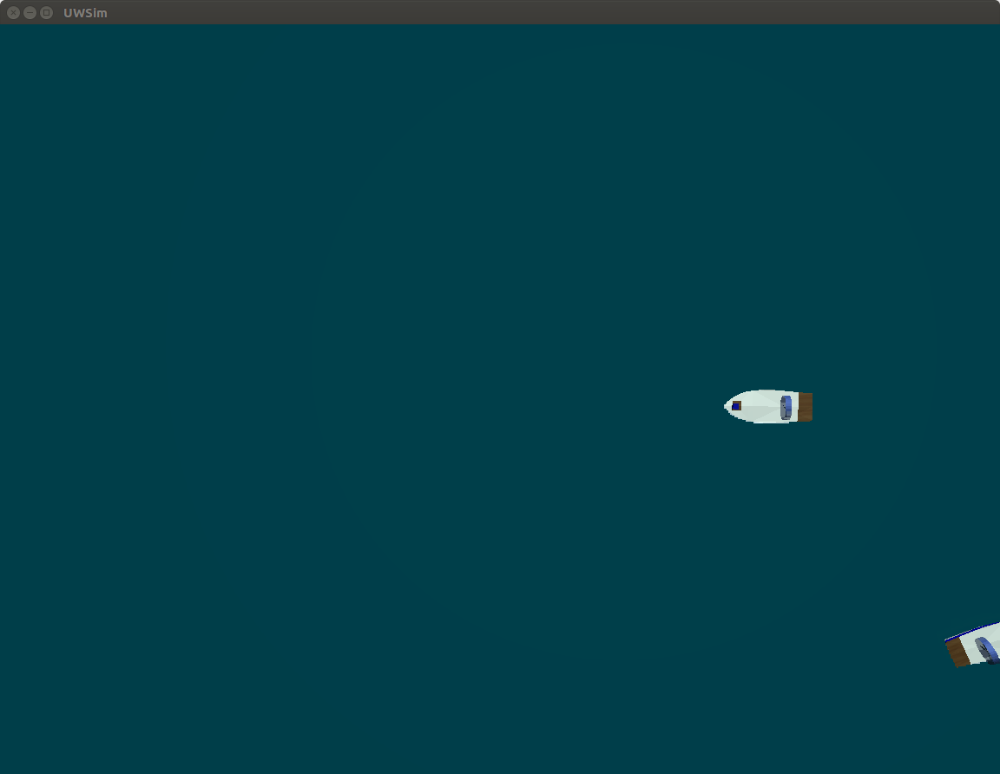

# IMR-INTEGRATION-HTN-USVSIM

# What is this

This project consists of an integration of an **Hierarchical Task Network (HTN) automated-planning system** and an **Unmanned Surface Vehicle (USV) simulator**. In this way, it is possible to simulate USVs in a realistic environment and implement autonomous guidance.

### HTN automated-planning system:  
JSHOP2  -> http://www.cs.umd.edu/projects/shop/description.html
### USV simulator:                  
USV_SIM -> https://github.com/disaster-robotics-proalertas/usv_sim_lsa

Below we can see the main architecture of this project:

From one side, the USV_GUIDER is responsible for interpreting the plan generated by the JSHOP2 and translate the defined actions into ROS commands. In the scope of this work, the ROS commands are linked to one boat. From the other side, the USV_GUIDER is responsible for translate conditions of the simulated environment to a description compliant to the JSHOP2 acceptable syntax. The conditions are captured through ROS topics. The USV_Guider was implemented in python using ROSlib library.

The JSHOP2 is originally developed to user interaction through GUI. For this integration, we have done small changes to allow JSHOP2 to be executed from command line, this way our system is capable of performing systems call to run JSHOP2 when needed. Every execution of JSHOP2 reinterprets the generated environment description and generates a new plan.

# What it does

Currently, the system is capable to guide one USV and try to avoid possible Head-On collision situations being compliant to the COOLREGs (Convention on the International Regulations for Preventing Collisions at Sea, 1972). The USV_GUIDER block is implemented in python and must be edited to allow new features.

# How to compile

For execution of this project its necessary to be capable of run [USV_SIM "fork"](https://github.com/Unmanned-Surface-Vehicle/usv_sim_lsa/tree/268edc0277086f1b86e2ffff4533ca710aa4fdf0), [JSHOP2 "fork"](https://github.com/Automated-Planning/jshop2/tree/f704d9e7193495aa45670c4fe6d4a5eb3677bef0), and python 2.7. USV_SIM "fork" and JSHOP2 "fork" contains its on installation guide.

# How to execute an example

### Head-On situation example
###### General Instructions:

For replication of the presented experiment 3 main repository are required: JSHOP2 fork, USV SIM fork, and USV GUIDER. It is required to install the USV SIM epository as a catkin package and run the repository as follow:

    ~/catkin_ws$ \catkin_make_isolated --install
    ~/catkin_ws$ source install_isolated/setup.bash
    ~/catkin_ws$ roslaunch usv_sim airboat_scenario4_intruder.launch parse:=true
    ~/catkin_ws$ roslaunch usv_sim airboat_scenario4_intruder.launch parse:=false gui:=true
    
After the simulation is opened its necessary to click start in the Gazebo simulator.
For the USV_GUIDER execution is required to run:

    /USV_GuidanceSystem$ ./run.sh

Is expected that after the execution of the command above, the controlled boat start to move straight ahead and when finding some obstacle try to avoid collision, in a behavior similar to the sequence presented below:

